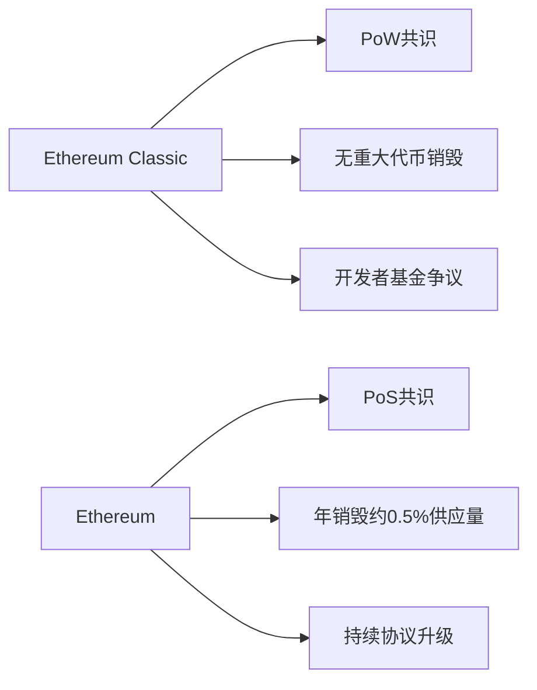

# 什么是以太坊经典与ETC币？（动画详解）

## 什么是以太坊经典？

当提到以太坊时，大多数人会联想到市值第二大的加密货币巨头。但鲜为人知的是，这个项目还有个"孪生兄弟"——以太坊经典（Ethereum Classic）。两者同源异流，却在发展路径上分道扬镳。

👉 [区块链技术如何改变金融未来？](https://bit.ly/okx_welcome)

### 关键概念解析
- **区块链技术**：分布式账本系统，确保交易透明不可篡改
- **智能合约**：自动执行的协议，代码即法律
- **PoW机制**：工作量证明共识算法，保障网络安全
- **硬分叉事件**：区块链发展的重大转折点

## 以太坊经典诞生记

2016年，以太坊遭遇The DAO事件冲击。社区面临重大抉择：
1. **回滚交易**：修复漏洞但违背区块链不可篡改原则
2. **维持原链**：坚持去中心化但承担经济损失

最终形成的两条链：
| 项目        | 以太坊（ETH） | 以太坊经典（ETC） |
|-----------|------------|----------------|
| 共识机制    | PoS权益证明  | PoW工作量证明     |
| 创始区块    | 2015年7月30日 | 2015年7月30日     |
| 硬分叉时间  | 2016年7月20日 | 2016年7月20日     |
| 当前发展状态 | 主流采用     | 小众坚守者       |

## ETC币的核心价值

作为以太坊经典网络的原生代币，ETC具有三重属性：
1. **交易媒介**：支付链上手续费
2. **价值存储**：总量固定2.1亿枚
3. **治理工具**：参与网络升级投票

👉 [如何安全存储数字资产？](https://bit.ly/okx_welcome)

### 常见问题解答
**Q1：ETC和ETH能同时持有吗？**  
A：完全独立，可在不同钱包分别管理

**Q2：ETC的PoW机制是否过时？**  
A：支持者认为这保障抗审查性，反对者担忧能源消耗

**Q3：ETC网络有哪些实际应用？**  
A：DeFi协议、NFT市场、跨境支付等场景均有部署

## 技术架构解析

以太坊经典保持原始设计哲学：
- **图灵完备虚拟机**：支持复杂智能合约
- **区块时间**：约13-15秒
- **难度炸弹机制**：逐步增加挖矿难度

与ETH的主要差异：

## 应用生态全景

尽管市值不及ETH，ETC生态仍呈现特色发展：
1. **DeFi领域**：ETCSwap、ChainCash等协议
2. **跨链桥接**：ETC与比特币的原子交换
3. **物联网支付**：低手续费特性吸引微型交易

👉 [探索区块链应用场景](https://bit.ly/okx_welcome)

### 投资者关注点
| 指标        | ETC表现    | 市场平均   |
|-----------|----------|----------|
| 市值排名   | #15-20位 | -        |
| 流通量     | 1.4亿枚   | -        |
| 算力分布   | 高度集中   | 分散化趋势 |
| 开发活跃度 | 稳定       | 高频更新   |

## 未来挑战与机遇

**技术层面**：
- 伦敦升级：ETIP-1提案调整Gas费用模型
- 跨链整合：与Polkadot等生态建立桥接

**市场层面**：
- 机构投资者关注度提升
- 美联储政策对PoW资产的影响

### 投资者问答
**Q：ETC是否适合长期持有？**  
A：取决于对去中心化理念的认同程度，需关注网络算力变化

**Q：如何参与ETC生态建设？**  
A：可通过开发DApp、运行节点、参与治理等方式

**Q：ETC面临哪些安全风险？**  
A：51%攻击历史事件警示需持续优化共识机制

## 行业发展展望

随着区块链技术演进，ETC的独特定位可能催生新机遇：
1. **价值储存**：作为数字黄金的替代选择
2. **抗审查网络**：在监管严格的地区发挥作用
3. **学术研究**：对比不同共识机制的天然实验室

尽管面临ETH的持续进化压力，ETC社区仍坚持"代码即法律"的核心理念。这种技术哲学的分野，或许正是区块链世界多样性的魅力所在。