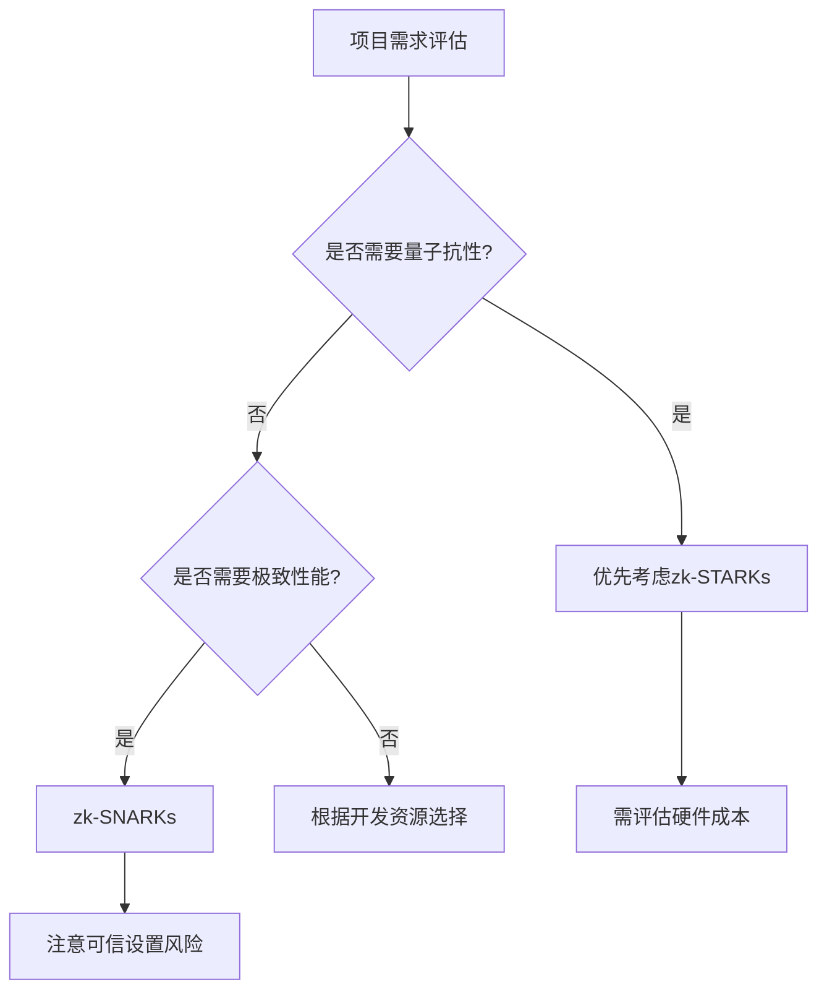

# 全面比较：什么是 zk-SNARKs 和 zk-STARKs？

在区块链技术发展过程中，零知识证明（ZKP）已成为解决扩展性和隐私保护的核心技术。其中 zk-SNARKs 和 zk-STARKs 是两种最主流的实现方案，本文将深入解析它们的技术原理、特性差异及应用场景。

---

## 核心概念解析

### 什么是零知识证明？
零知识证明（Zero-Knowledge Proof）是一种密码学协议，允许**证明者**在不透露具体信息的前提下，向**验证者**证明某个命题的真实性。例如：
- 证明你掌握某个密码而不暴露密码本身
- 验证交易有效性而不显示交易金额
- 确认身份信息而不泄露个人数据

这种技术为区块链带来了革命性突破：
- **可扩展性**：通过二层网络实现每秒数千笔交易
- **隐私性**：隐藏敏感数据同时保持链上可验证性
- **安全性**：防止恶意攻击者伪造数据

---

## zk-SNARKs 技术深度解析

### 技术原理
zk-SNARKs（零知识简洁非交互式知识证明）通过数学转换将计算过程转化为多项式问题，其核心流程包括：
1. **可信设置**：生成结构化参考字符串（SRS）
2. **电路编译**：将计算逻辑转化为算术电路
3. **证明生成**：使用椭圆曲线加密创建证明
4. **验证过程**：通过双线性配对快速验证

### 核心特性

| 特性维度       | 详细说明                                                                 |
|----------------|--------------------------------------------------------------------------|
| **证明大小**   | 通常小于1KB，适合带宽受限场景                                           |
| **验证速度**   | 毫秒级验证时间，适合高频交易场景                                        |
| **可信设置**   | 需要多参与者仪式生成SRS，存在"有毒废料"安全风险                          |
| **量子抗性**   | 依赖ECC（椭圆曲线加密），易受量子计算机攻击                              |
| **开发生态**   | Zcash、Polygon Hermez等项目已落地，工具链成熟                           |

### 典型应用场景
👉 [区块链扩展方案](https://bit.ly/okx_welcome)：如Zcash的隐私交易系统，每秒处理50+隐私交易  
👉 企业级数据验证：金融机构在不暴露客户数据的前提下验证合规性

---

## zk-STARKs 技术突破

### 技术原理
zk-STARKs（零知识可扩展透明知识证明）采用完全不同的设计哲学，其核心创新包括：
1. **透明设置**：使用公开随机数生成参数，无需可信仪式
2. **抗量子算法**：基于哈希函数构建数学证明
3. **可扩展性优化**：通过交互式证明压缩技术提升性能

### 核心特性对比

| 特性维度       | zk-SNARKs                        | zk-STARKs                        |
|----------------|----------------------------------|----------------------------------|
| **证明大小**   | 1KB以下                          | 10KB-100KB                       |
| **验证时间**   | 10ms以内                         | 100ms-1s                         |
| **量子抗性**   | 弱（ECC易受攻击）                | 强（基于哈希函数）               |
| **设置要求**   | 需可信仪式                       | 完全透明                         |
| **硬件依赖**   | 普通CPU即可                      | 需要高性能计算资源               |

### 技术优势
- **无需信任假设**：消除了SRS泄露风险
- **抗量子计算**：SHA-256等哈希函数量子安全
- **大规模计算优化**：证明时间随计算复杂度线性增长

---

## 核心差异全景图

### 技术架构对比

| 对比维度        | zk-SNARKs                        | zk-STARKs                        |
|-----------------|----------------------------------|----------------------------------|
| 数学基础        | 椭圆曲线+双线性配对              | 哈希函数+交互式证明              |
| 证明生成时间    | O(n log n)                       | O(n log n)                       |
| 验证时间        | O(1)                             | O(log n)                         |
| 内存占用        | 低                               | 高                               |
| 开发复杂度      | 中等                             | 高                               |
| 生态成熟度      | 主流框架成熟                     | 新兴技术，工具链持续完善         |

### 商业应用权衡

👉 [区块链项目选择指南](https://bit.ly/okx_welcome)：  
- **需要极致性能**：选择zk-SNARKs（如高频交易场景）  
- **重视量子安全**：优先zk-STARKs（如长期数据存储）  
- **注重透明治理**：zk-STARKs更适合公共区块链项目

---

## 技术演进趋势

### 行业动态
- **量子计算威胁**：2024年IBM量子计算机突破1000量子比特，传统ECC面临现实威胁
- **证明系统融合**：最新研究显示结合两种技术的混合方案可平衡性能与安全
- **硬件加速突破**：GPU/FPGA专用证明生成设备将证明时间降低50%

### 标准化进程
- ISO/IEC 19537:2023 零知识证明标准已发布
- 中国信通院主导的《隐私计算零知识证明技术应用指南》进入征求意见阶段

---

## 常见问题解答

**Q1：zk-SNARKs的可信设置如何保证安全性？**  
A：通过多方计算（MPC）仪式，参与者需销毁本地密钥分片。理论上只要有一个参与者诚实即可保证安全，但实际操作中仍存在风险。

**Q2：zk-STARKs的证明体积大是否影响区块链扩展？**  
A：确实存在存储压力，但通过分层存储结构（链上存根+链下完整证明）和压缩算法可缓解。StarkWare的Volition方案已实现存储效率提升80%。

**Q3：两种技术的量子抗性差异？**  
A：zk-SNARKs依赖的ECC理论上可在量子计算机上被Shor算法破解，而zk-STARKs使用的哈希函数需要Grover算法暴力破解，量子机需10^12年才能破解256位哈希。

**Q4：开发者如何选择合适的技术？**  
A：建议评估四个维度：1）性能需求 2）安全等级 3）开发成本 4）社区支持。初创项目可优先使用zk-SNARKs快速落地，大型机构建议采用zk-STARKs。

**Q5：未来技术融合可能性？**  
A：已有研究将STARKs作为SNARKs的后量子增强层，通过分层证明系统兼顾性能与安全。但技术复杂度较高，短期内难以大规模应用。

---

## 技术演进时间线

| 年份  | 重要里程碑                                      | 技术影响                              |
|-------|-----------------------------------------------|---------------------------------------|
| 2012  | zk-SNARKs理论突破 [Bit+12]                    | 实现首个实用化零知识证明系统          |
| 2016  | Groth16协议发布                               | 证明大小优化至192字节                 |
| 2018  | zk-STARKs概念提出                             | 首次实现透明设置证明系统              |
| 2020  | PLONK协议支持通用电路证明                     | 降低可信设置重复成本                  |
| 2023  | Polygon宣布10亿美元zkEVM生态投资              | 推动ZKP在以太坊生态的全面应用         |
| 2024  | StarkWare完成STARKs证明生成加速器开发         | 证明时间降低至传统方案的1/5           |

---

## 技术选型决策树

👉 [获取技术选型白皮书](https://bit.ly/okx_welcome)：包含详细性能测试数据和成本分析  

这种系统化的分析框架可帮助技术团队快速定位最佳方案。对于需要平衡不同需求的项目，建议采用模块化设计，为不同功能模块选择最适合的证明系统。

---

## 未来展望

随着零知识证明技术的持续演进，我们正在见证几个关键趋势：
1. **证明生成加速**：专用ASIC芯片将证明时间从秒级压缩到毫秒级
2. **跨链互操作性**：基于ZKP的轻节点验证将成为跨链通信标准
3. **隐私AI**：将ZKP与联邦学习结合，实现可验证的隐私机器学习
4. **监管科技**：满足GDPR等数据保护法规的合规性证明系统

👉 [探索区块链技术前沿](https://bit.ly/okx_welcome)：获取最新技术动态和行业研究报告  

这些技术突破将推动零知识证明从区块链扩展走向更广泛的数字化信任基础设施建设，重塑数字时代的隐私保护与数据验证范式。