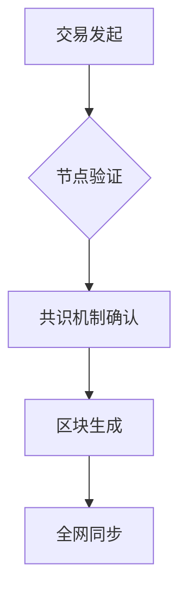

# 数字货币：未来货币形态的全面解析

## 什么是数字货币？

数字货币（Digital Currency）是以数字形式存在的价值载体，通过密码学技术保障交易安全，具有去中心化、可编程、可追溯等特性。其形态涵盖央行数字货币（CBDC）、加密货币（如比特币）、电子支付工具（如支付宝余额）等多种形式。

**核心特征**：
1. 无实体介质
2. 交易可追溯
3. 技术驱动发行
4. 多维度价值体系

👉 [深入了解数字货币投资策略](https://bit.ly/okx_welcome)

## 数字货币的演进历程

### 起源与发展阶段
| 阶段 | 标志性事件 | 技术特征 |
|------|------------|----------|
| 1980s | 电子现金实验 | 中心化系统 |
| 2008年 | 比特币白皮书 | 区块链技术 |
| 2014年 | 各国央行研究 | 法定数字货币 |
| 2020年 | DeFi爆发 | 智能合约应用 |

**技术演进逻辑**：从中心化电子支付→加密货币→央行数字货币→可编程金融生态

## 核心概念辨析

### 数字货币 vs 电子货币
| 维度 | 数字货币 | 电子货币 |
|------|----------|----------|
| 发行主体 | 去中心化网络/央行 | 商业银行 |
| 技术基础 | 区块链/分布式账本 | 中心化数据库 |
| 法律地位 | 特定场景支付 | 法定货币等价物 |
| 交易特性 | 点对点/跨境 | 依赖银行体系 |

### 数字货币 vs 虚拟货币
- **本质区别**：数字货币具有现实价值锚定，虚拟货币仅限特定生态使用
- **典型案例**：比特币（数字货币） vs 游戏金币（虚拟货币）

👉 [对比主流数字货币技术架构](https://bit.ly/okx_welcome)

## 技术原理与实现机制

### 核心技术栈
1. **密码学**：椭圆曲线加密、哈希算法保障交易安全
2. **共识机制**：PoW/PoS/BFT等确保节点信任
3. **分布式账本**：全网节点共同维护交易记录
4. **智能合约**：自动执行可编程协议

### 交易验证流程

## 应用场景分析

### 主要应用领域
1. **跨境支付**
   - SWIFT系统耗时3-5天 vs 数字货币实时到账
   - 成本从6%降至0.1%
2. **供应链金融**
   - 可追溯特性解决中小企业融资难题
3. **数字身份认证**
   - 基于区块链的KYC解决方案
4. **资产证券化**
   - 房地产、艺术品等实体资产代币化

👉 [探索数字货币在国际贸易中的应用](https://bit.ly/okx_welcome)

## 经济影响与社会变革

### 对传统金融体系的冲击
- **货币政策**：央行数字货币可能改变货币乘数效应
- **支付体系**：重塑全球支付清算网络
- **金融包容性**：让17亿无银行账户人口获得金融服务

### 社会治理创新
- **反洗钱**：交易可追溯降低犯罪风险
- **财政补贴**：精准投放社会福利资金
- **税收征管**：实时追踪经济活动数据

## 发展挑战与应对策略

### 主要挑战分析
| 挑战领域 | 具体问题 | 解决方向 |
|----------|----------|----------|
| 监管框架 | 跨境监管冲突 | 监管沙盒机制 |
| 技术瓶颈 | 每秒交易量 | 分层架构设计 |
| 用户隐私 | 数据保护 | 零知识证明 |
| 环境影响 | 挖矿能耗 | 绿色能源挖矿 |

### 未来发展趋势
1. **混合型货币体系**：CBDC与私营数字货币共存
2. **监管科技**：RegTech成为行业标配
3. **元宇宙经济**：构建数字孪生世界的价值载体

## 常见问题解答

### Q1：数字货币会取代现金吗？
A：在可预见的未来，数字货币将与现金并存。根据BIS研究，全球86%的央行正在研究CBDC，但完全替代现金需要解决技术、法律、用户习惯等多重问题。

### Q2：如何安全存储数字货币？
A：推荐采用"冷热分离"策略：
- 日常交易使用硬件钱包（如Ledger）
- 长期存储选择离线存储
- 重要资产实施多重签名

### Q3：数字货币投资存在哪些风险？
A：主要风险包括：
1. 市场波动风险（比特币年化波动率常超50%）
2. 监管政策变动风险
3. 技术安全风险（交易所被黑事件年损失超40亿美元）

### Q4：普通人如何参与数字货币经济？
A：参与路径：
- 数字货币储蓄（年化收益可达4-8%）
- 参与DeFi流动性挖矿
- 数字资产配置（建议不超过资产的5%）

## 未来展望

全球数字货币市场正经历指数级增长，Statista数据显示，2023年全球加密货币市值突破2万亿美元，数字支付规模达12万亿美元。随着各国央行数字货币的推进和技术的持续创新，预计到2030年，数字货币将深度融入全球经济体系，重塑人类价值交换方式。